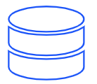
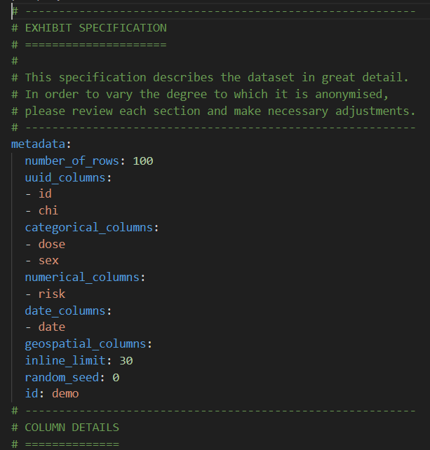
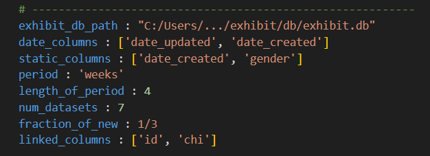
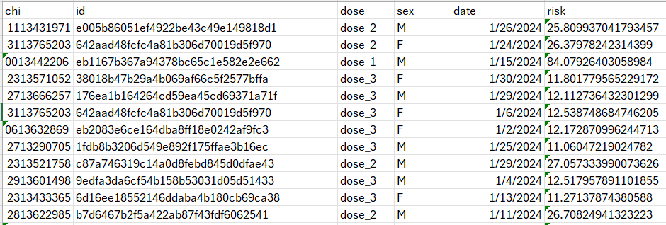

# Series-Generation Tool




The Exhibit Series Generation tool is designed to generate a series of datasets over several periods using the Exhibit framework. The tool enables users to simulate periodic updates on synthetic data, accounting for new entities and updates to existing entities.
## Purpose  
The tool is useful for developers who need realistic series synthetic data for testing data processing pipelines where new records are generated with every new period, and part of the existing records are updated. Periodic data is useful for developing ETL where slowly changing dimensions are updated while natural keys and some rows are maintained as in previous files. To simulate periodic updates, each period will have new records and updates to existing records. And an updated at date column that is used to determine which records to include in the load.
## Key Features
•	Generate serial datasets over multiple periods, for example a series of monthly datasets

•	Incorporate both new and existing entities to simulate updates

•	Dynamic date updates

•	Maintaining records of existing entities
## How It Works
 
For an in-depth explanation of the inner workings, please refer to the [How It Works](HOW_IT_WORKS.md) document.

## User provides:
Two YAML files:
  - Exhibit specification file with dates for first period
  - User input file describing:
     - path to exhibit db
     - date columns to be updated
     - static columns to be maintained for existing entities
     - The period of the series, can either be ‘months’, ‘weeks’ or ‘days’
     - The length of period, an integer
     - The number of datasets, an integer
     - The required fraction of new records vs existing records in each period
     - List of linked columns

######  


## How to use:
Install exhibit


```pip install ehxibit```


Install Sklearn


```pip install scikit-learn```


Run the series generation tool, providing paths to the specification yaml and user_input yaml


```python Series_generation.py --specification example_spec.yml --user_input example_user_input.yml```


To use the example user_input yaml template, open the template and provide exhibit_db path.

###### example generated data

